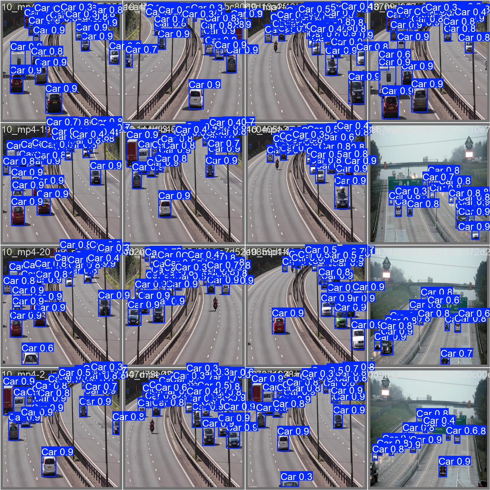
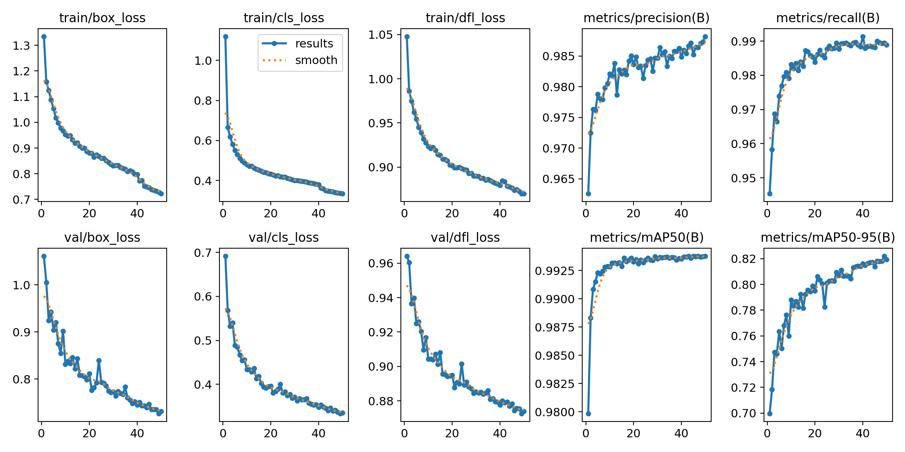
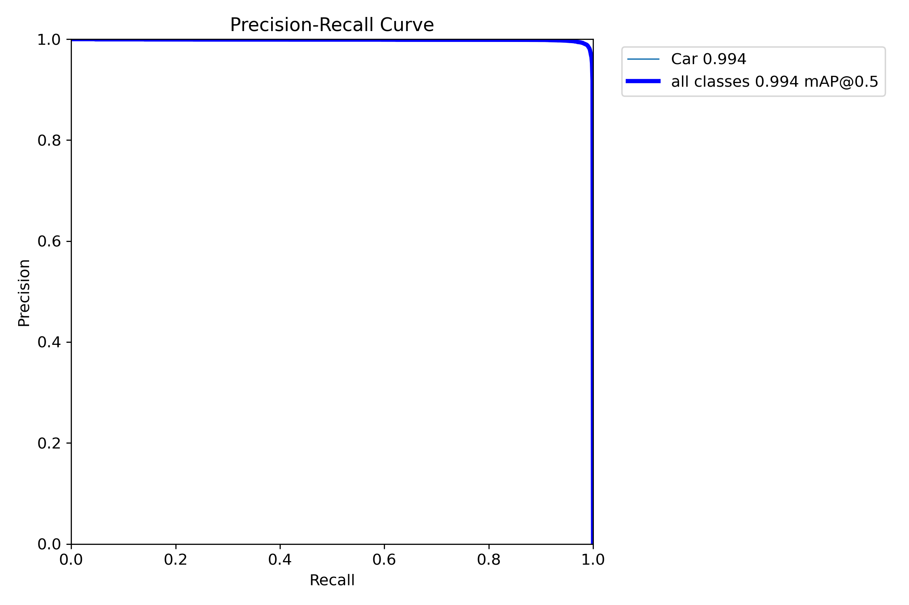
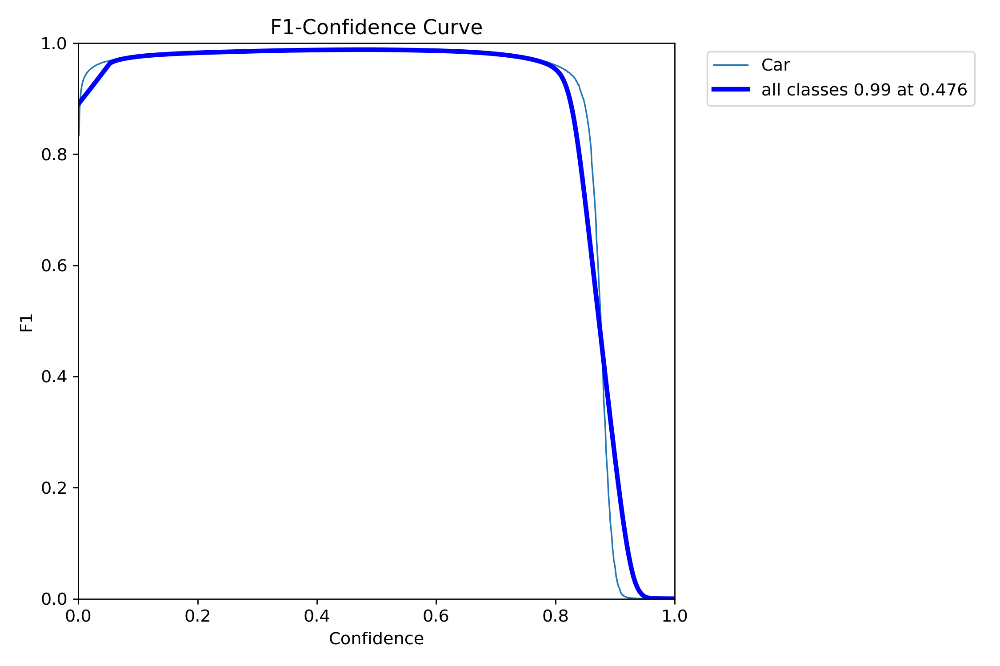
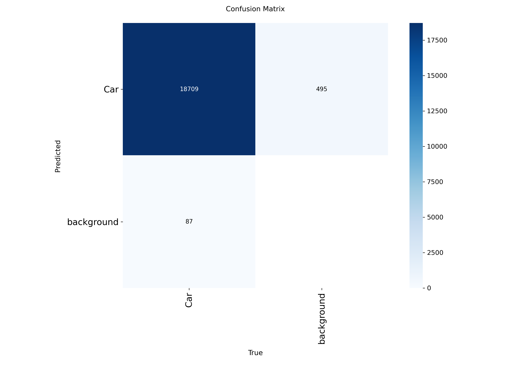
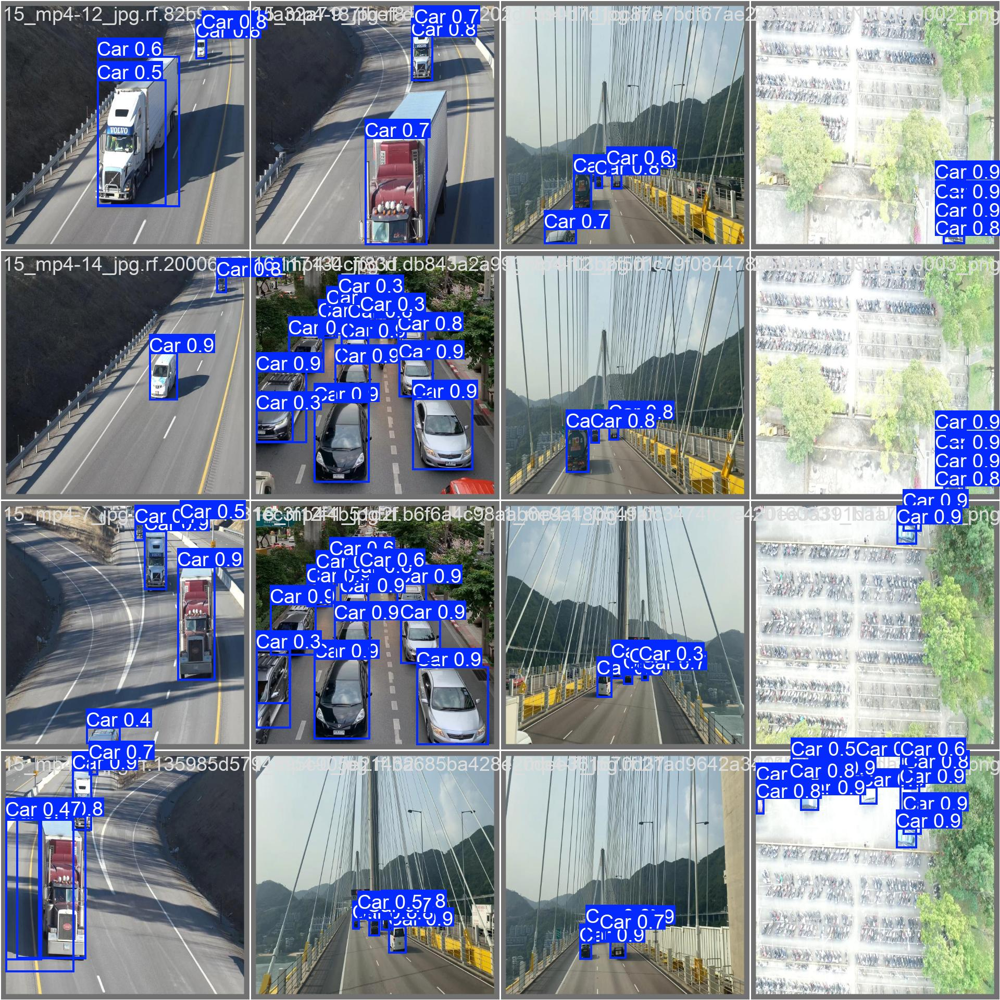
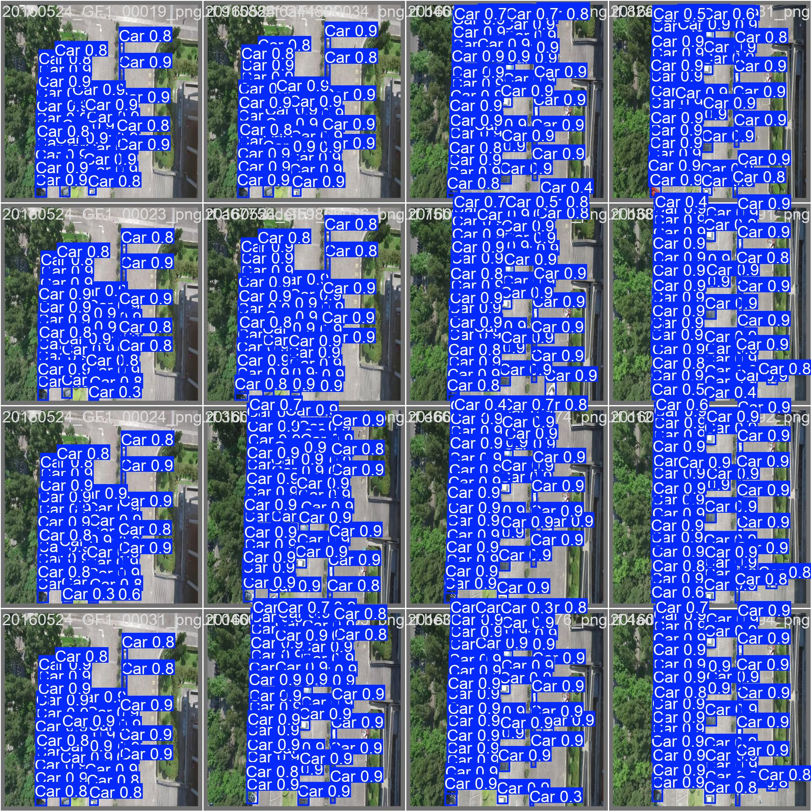

# Smart Parking AI

Real-time parking detection through your browser camera. Open the app, point your camera at a parking area, and watch AI track which spaces are free.

No mobile app to install. No external services needed. Just open the URL and allow camera access. **Live Link** : https://smart-parking-ai-ozuf.onrender.com

   

---

## How It Looks

The model detects vehicles in real time and overlays the result directly on the camera feed. Green = free, red = occupied.



*The model detecting dozens of cars in a dense aerial parking lot view.*

---

## Features

- **Browser camera detection** — works on any phone, tablet, or laptop. No app install.
- **Live overlay** — green and red boxes drawn directly on the camera view.
- **Custom-trained model** — 99.4% accuracy on parking detection, trained on 4,500+ images.
- **Interactive calibration** — draw your own parking spaces with click and drag.
- **Analytics dashboard** — hourly trends, weekly heatmap, next-hour prediction.
- **Smart recommendations** — suggests which space to take based on usage patterns.
- **Persistent storage** — SQLite database, data survives restarts.
- **One-click demo data** — populates 30 days of history to showcase analytics.

---

## How It Works

```
Browser camera  ──►  Flask server  ──►  Detection model
                                              │
                                              ▼
                                      Vehicle bounding boxes
                                              │
                                              ▼
                                  Overlap check vs parking spaces
                                              │
                                              ▼
                                  Status: free / occupied
                                              │
                                              ▼
                              SQLite storage + Live dashboard
```

Every 2 seconds the browser captures a frame, sends it to the server, the AI detects vehicles, and the result is overlaid back on the camera view.

---

## Model Performance

The detection model was custom-trained on **4,505 images** from public parking datasets (CARPK + Top-View Road) over 50 epochs.

### Final Metrics

| Metric | Score |
|---|---|
| **mAP@50** | **99.4%** |
| **mAP@50-95** | **82.2%** |
| **Precision** | **98.7%** |
| **Recall** | **98.9%** |
| **Inference speed** | ~2ms per frame |

### Training Curves



*All metrics converge smoothly — losses dropping, precision/recall climbing past 98% by epoch 20 and holding stable. No overfitting signs across the 50-epoch run.*

### Precision-Recall Curve



*Near-perfect performance: the curve stays pinned at the top right, with mAP@0.5 = 0.994.*

### F1 Score



*Peak F1 of 0.99 at a confidence threshold of 0.476 — meaning the model maintains balanced precision and recall across most confidence ranges.*

### Confusion Matrix



*18,709 cars correctly detected, with only 87 missed and 495 false positives out of 19,291 ground-truth instances.*

---

## Detection Samples

The model handles a wide range of conditions — aerial views, road traffic, mixed angles, and varying lighting.

### Aerial Dense Parking


### Road and Traffic Scenes


### Mixed Real-World Conditions


All detections shown above are from the held-out validation set the model never saw during training.

---

## Quick Start

### Requirements
- Python 3.10+
- A camera (laptop webcam or phone browser)

### Install
```bash
git clone https://github.com/muad500/smart-parking-ai.git
cd smart-parking-ai

pip install -r requirements.txt
```

### Run
```bash
python app.py
```

Open `http://localhost:5050` in your browser. Click **Start Camera**, allow access, and you're live.

---

## How to Use

### 1. Start the camera
Click **Start Camera** on the Live page. Allow access when your browser prompts.

### 2. Calibrate parking spaces
Go to the **Calibrate** tab:
- Click **Capture Snapshot**
- Click and drag on the image to draw each parking space
- Name them (A1, A2, B1, etc.)
- Click **Save Spaces**

Or click **Use Default Layout** for a quick 6-space test.

### 3. Watch detection live
Switch back to Live. Spaces appear directly on the camera, color-coded by status. Stats update every 2 seconds.

### 4. View analytics
The Analytics tab shows hourly patterns, day-of-week trends, and a 7×24 weekly heatmap. Click **Load Demo Data** to populate it with 30 days of realistic data for testing.

---

## Project Structure

```
smart-parking-ai/
├── app.py              Main application (Flask + detection + dashboard)
├── best.pt             Trained model weights (6 MB)
├── spaces.json         Saved parking space coordinates
├── requirements.txt    Python dependencies
├── parking_data.db     SQLite database (auto-created)
├── docs/               Training results and detection samples
└── README.md
```

---

## Tech Stack

| Layer | Technology |
|---|---|
| Detection | YOLOv8 (custom-trained) |
| Backend | Flask, OpenCV, NumPy |
| Storage | SQLite |
| Frontend | Vanilla JS, Chart.js, Canvas API |
| Camera | Browser MediaDevices API |

---

## Training Details

- **Dataset**: CARPK + Top-View Road (Roboflow)
- **Images**: 4,505 training, 383 validation
- **Model**: YOLOv8 nano
- **Epochs**: 50
- **Batch size**: 8
- **Optimizer**: AdamW
- **Hardware**: NVIDIA RTX 4070 Ti

The model converged after roughly 20 epochs but training continued to 50 for stability margins.

---

## Privacy Note

All camera processing happens on the server. Frames are not stored — only the count of free and occupied spaces is saved to the local database.

When deployed locally, nothing leaves your machine.

---

## Roadmap

- [ ] Multi-camera support
- [ ] Live cloud deployment
- [ ] Mobile-optimised layout improvements
- [ ] Export analytics as CSV/PDF
- [ ] Reservation system integration

---

## License

MIT

---

## Author

**Mouad Waseem Syed**

Built as a practical exploration of computer vision and real-time systems.
